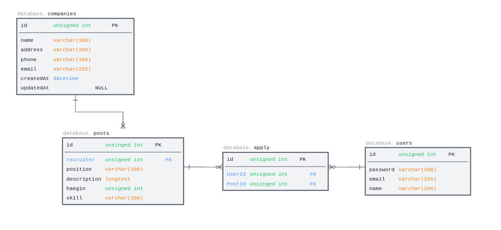

# wanted-pre-onboarding-backend
원티드 프리온보딩-백엔드 지원 프로젝트 설명

## 1. 파일 구조
```
wanted_pre_onboarding
├── config ** 관련 설정
├── controllers ** 컨트롤러 route와 service를 연결
├── migrations
├── models ** 데이터 베이스 연결 및 ORM 모델작성
├── routes ** url 경로 모음
├── seeders
├── services **비즈니스 로직 작성
├── util ** 비즈니스 공통적으로 사용하는 코드
├── package-lock.json
├── package.json
├── app.js ** 노드 서버 실행파일
└── README.md ** 프로젝트 설명파일
```
3-layer방식으로 프로젝트 파일 구성      

참고 링크    
[서버에 3 Layer Architecture 적용하기](https://velog.io/@ju_h2/Node-express-%EC%84%9C%EB%B2%84%EC%97%90-3-Layer-Architecture-%EC%A0%81%EC%9A%A9%ED%95%98%EA%B8%B0)  
## 2. 사용 npm 라이브러리
```zsh
"bcrypt": "^5.1.0",
"cors": "^2.8.5",
"dotenv": "^16.0.3",
"express": "^4.18.2",
"morgan": "^1.10.0",
"mysql2": "^2.3.3",
"routes": "^2.1.0",
"sequelize": "^6.24.0",
"sequelize-cli": "^6.5.1"
```
## 3. ERD
ERD </br>
--------

## 4. 구현 기능
1. 회사, 일반회원(지원자) 구분  
회원 - 가입 기능 (users/signin)     
회사 - 가입 기능 (company/signin)

2. 채용 공고 (회사 회원만 가능)  
공고 입력 (posts/write),         
변경 (posts/edit),      
삭제[hard delete] (posts/delete/[postId]),   
모든 채용 공고 출력 (posts/) 

### 추가 구현
1. 채용 공고 상세페이지 조회
(posts/[postID])
2. 사용자 채용 공고 지원
(users/apply)